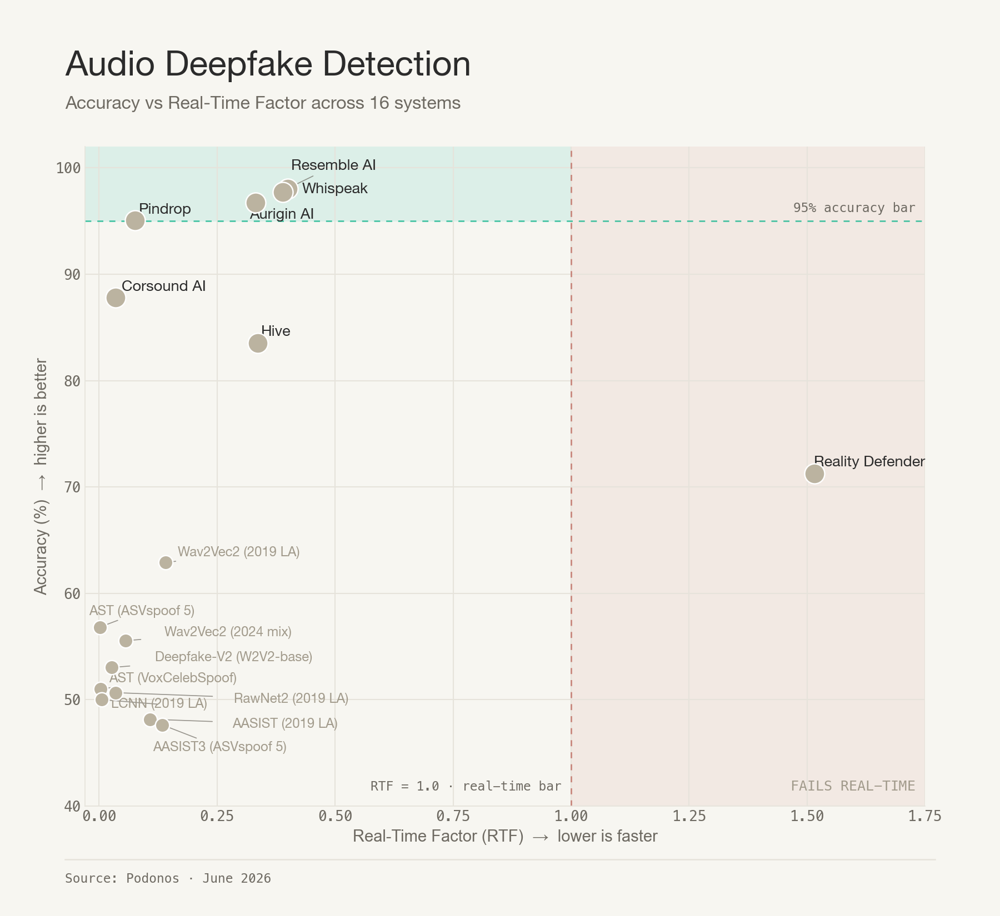

# Deepfake Audio Detection Benchmark


A neutral, public benchmark for evaluating audio deepfake detection systems on a diverse, format-rich dataset.

> **Why this benchmark?** Self-reported deepfake detection scores are often unreliable due to overfitting on public test sets and selective reporting. This project hosts a fixed evaluation set with **private gold-standard labels** held by Podonos, scoring submissions in a verifiable, apples-to-apples manner.

---

## Leaderboard


**17 systems** evaluated — 8 commercial APIs (**bold**) and 9 open-source baselines — sorted by accuracy. Company and model names link to their source.

| # | System | N | Rej% | Acc% | F1 | FPR% | FNR% | Lat(ms) | RTF |
|---|--------|---|------|------|-----|------|------|---------|-----|
| 1 | **[Resemble AI](https://www.resemble.ai)** | 4524 | 0.0% | **98.05%** | 0.981 | 2.5% | 1.4% | 1,164 | 0.40 |
| 2 | **[Whispeak](https://whispeak.io)** | 4524 | 0.0% | 97.70% | 0.977 | 2.9% | 1.7% | 1,052 | 0.39 |
| 3 | **[Aurigin AI](https://aurigin.ai)** | 4524 | 0.0% | 96.75% | 0.967 | 1.5% | 5.0% | 980 | 0.33 |
| 4 | **[Pindrop](https://www.pindrop.com)** | 4524 | 0.0% | 95.05% | 0.951 | 6.2% | 3.7% | 282 | 0.076 |
| 5 | **[Corsound AI](https://www.corsound.ai)** | 3875 | 14.3% | 87.79% | 0.865 | 1.0% | 23.1% | 180 | 0.035 |
| 6 | **[Hive](https://thehive.ai)** | 4524 | 0.0% | 83.53% | 0.808 | 2.4% | 30.5% | 881 | 0.34 |
| 7 | **[Reality Defender](https://www.realitydefender.com)** | 3745 | 17.2% | 71.27% | 0.770 | 53.7% | 3.6% | 5,718 | 1.52 |
| 8 | **[Synhawk](https://synhawk.com)** | 4524 | 0.0% | 67.37% | 0.722 | 50.0% | 15.2% | N/A | N/A |
| 9 | [Wav2Vec2 (2019 LA)](https://huggingface.co/Gustking/wav2vec2-large-xlsr-deepfake-audio-classification) | 4524 | 0.0% | 62.89% | 0.514 | 13.4% | 60.8% | 622 | 0.14 |
| 10 | [AST (ASVspoof 5)](https://huggingface.co/MattyB95/AST-ASVspoof5-Synthetic-Voice-Detection) | 4524 | 0.0% | 56.83% | 0.657 | 69.0% | 17.4% | 5 | 0.0017 |
| 11 | [Wav2Vec2 (2024 mix)](https://huggingface.co/garystafford/wav2vec2-deepfake-voice-detector) | 4524 | 0.0% | 55.55% | 0.499 | 33.1% | 55.8% | 219 | 0.056 |
| 12 | [Deepfake-V2 (W2V2-base)](https://huggingface.co/MelodyMachine/Deepfake-audio-detection-V2) | 4524 | 0.0% | 53.03% | 0.162 | 3.1% | 90.9% | 94 | 0.027 |
| 13 | [AST (VoxCelebSpoof)](https://huggingface.co/MattyB95/AST-VoxCelebSpoof-Synthetic-Voice-Detection) | 4524 | 0.0% | 50.99% | 0.048 | 0.5% | 97.5% | 8 | 0.0030 |
| 14 | [RawNet2 (2019 LA)](https://huggingface.co/MattyB95/pre_trained_DF_RawNet2) | 4524 | 0.0% | 50.66% | 0.430 | 35.9% | 62.7% | 94 | 0.035 |
| 15 | [LCNN-LFCC (2019 LA)](https://huggingface.co/MattyB95/pre_trained_DF_LFCC-LCNN) | 4524 | 0.0% | 50.00% | 0.667 | 100.0% | 0.0% | 23 | 0.0056 |
| 16 | [AASIST (2019 LA)](https://github.com/clovaai/aasist) | 4524 | 0.0% | 48.17% | 0.486 | 52.6% | 51.1% | 322 | 0.11 |
| 17 | [AASIST3 (ASVspoof 5)](https://huggingface.co/lab260/AASIST3) | 4524 | 0.0% | 47.63% | 0.029 | 6.3% | 98.4% | 363 | 0.13 |

**Legend**:
- **N** — number of evaluated audio files
- **Rej%** — % of files the API rejected (NOT_APPLICABLE / errors)
- **Acc%** — overall accuracy
- **FPR%** — false positive rate (real flagged as fake)
- **FNR%** — false negative rate (fake missed)
- **Lat(ms)** — average per-file inference latency
- **RTF** — real-time factor: prediction-time / audio-duration (lower is better)

### Observations

**Top tier — four commercial APIs clear 95 %:**

Four production APIs separate themselves from the rest, all above 95 % accuracy with F1 ≥ 0.95. The choice between them comes down to which error you can least afford and how fast you need an answer.

- **Resemble AI** — **98.05 % accuracy**, F1 **0.981**, **FNR 1.4 %**. Best at *catching fakes*: only ~1 in 70 deepfakes slips past it (FPR 2.5 %). Choose Resemble when **missing a deepfake is worse than a false alarm** — fraud / KYC voice verification, content provenance, anywhere letting a synthetic voice through is the high-cost outcome.
- **Whispeak** — **97.70 % accuracy**, F1 **0.977**, a balanced 2.9 % FPR / 1.7 % FNR. The most symmetric error profile in the top tier — strong on both real and fake audio without leaning either way.
- **Aurigin AI** — **96.75 % accuracy**, F1 **0.967**, **FPR 1.5 %** (the lowest of any system that also catches fakes). Best at *protecting real audio*: only ~1 in 65 genuine clips is wrongly flagged (FNR 5.0 %). Choose Aurigin when **false alarms on real audio are worse than missed fakes** — content moderation at scale, automated takedowns, journalist verification.
- **Pindrop** — **95.05 % accuracy**, F1 **0.951**, and by far the **fastest commercial API**: ~282 ms/file (RTF 0.076), roughly 4× faster than Resemble/Whispeak and ~20× faster than Reality Defender. Errors lean toward false positives (FPR 6.2 % vs FNR 3.7 %). The pick when **latency budget is tight** and you can tolerate a slightly higher false-alarm rate.

**Mid tier — accurate but with a catch:**
- **Corsound AI** — 87.8 % accuracy with the **lowest FPR of any commercial system (1.0 %)**, but a high 23.1 % FNR (misses ~1 in 4 fakes) and it **rejects 14.3 % of files** (it declines clips below its minimum duration). Very conservative: it almost never false-flags real audio, at the cost of letting fakes through.
- **Hive** — 83.5 % accuracy, FPR 2.4 % (very low), FNR 30.5 % (high). Same conservative shape as Corsound — rarely cries wolf, misses about a third of fakes.

**Bottom tier (commercial) — high false-alarm rates:**
- **Reality Defender** — 71.3 % accuracy with **FPR 53.7 %** (false-flags over half of all real audio). Also **rejects 17.2 % of files** — its engine cannot evaluate audio shorter than ~1.5 s — and runs **slower than real-time** (RTF 1.52).
- **Synhawk** — 67.4 % accuracy with **FPR 50.0 %**: it labels half of genuine clips as fake. Acceptable fake-catching (FNR 15.2 %) but unusable false-alarm rate on real audio.

**Open-source baselines — none generalize to modern TTS:**
- All nine open-source models land in the **48–63 %** band — near random for binary classification. This holds *regardless of training era*: models trained on legacy **ASVspoof 2019 LA** and ones trained on newer **ASVspoof 5 / VoxCelebSpoof** both collapse on this distribution, which is dominated by current commercial voice-cloning systems (ElevenLabs, F5-TTS, Chatterbox, …).
- **Wav2Vec2 (2019 LA)** is the strongest open baseline (62.9 %), reflecting the value of self-supervised audio representations.
- Several models are effectively **degenerate** — they collapse to predicting one class: **LCNN-LFCC** flags *everything* as fake (100 % FPR), while **AST (VoxCelebSpoof)** (97.5 % FNR), **AASIST3** (98.4 % FNR), and **Deepfake-V2** (90.9 % FNR) flag almost everything as real. Their headline accuracy is an artifact of the 50/50 class balance, not detection skill.
- Takeaway: **off-the-shelf academic checkpoints are not a substitute for a production detector** on real-world, format-diverse, modern-TTS audio.

**Latency / RTF:**
- Reality Defender's **RTF > 1.0** means it is slower than real-time — a 5-second clip takes ~7.6 s to process. Not viable for streaming.
- Every other detector runs faster than real-time (RTF < 1). Among the accurate commercial systems, **Pindrop is the fastest (RTF 0.076)**; Resemble, Whispeak, Aurigin, and Hive land around RTF 0.33–0.40.
- The open-source models run on local hardware (no network round-trip), so their low RTF reflects pure compute cost — but at this accuracy that speed buys little.
- *(Synhawk latency was not captured in this run and is shown as N/A.)*

### Error Profile


### Accuracy vs Real-Time Factor



---

## Dataset

- **4,524 audio files** spanning six formats: `.mp3`, `.wav`, `.flac`, `.ogg`, `.m4a`, `.webm`
- **Class balance**: 50/50 (real / fake)
- **Real audio** drawn from three established public corpora:
  - [VCTK](https://datashare.ed.ac.uk/handle/10283/3443) — 110 English speakers, multiple accents
  - [LJSPEECH](https://keithito.com/LJ-Speech-Dataset/) — single-speaker, ~24 hours of public-domain audiobook recordings
  - [LibriTTS-360](https://www.openslr.org/60/) — 360-hour subset of LibriTTS, 904 speakers
- **Synthetic audio**: ~25 commercial TTS / voice-cloning models including [Chatterbox](https://github.com/resemble-ai/chatterbox), [ElevenLabs](https://elevenlabs.io/), [Microsoft F5-TTS](https://github.com/SWivid/F5-TTS), and others
- **Quality verification**: All synthetic audio is round-trip transcribed with [OpenAI Whisper](https://github.com/openai/whisper) to ensure the TTS system synthesized the intended utterance, before format conversion.

See [`DATASET.md`](DATASET.md) for full construction details.

---

## Telephony Tracks (New)

Most real-world fraud, KYC, and call-center audio never arrives as a studio file. It comes over a phone or mobile/VoIP link: band-limited, resampled, and compressed by a low-bitrate speech codec. We provide **two telephony tracks** that stress detectors under those conditions. Each is the **same 4,524 clips and the same hidden labels** as the main benchmark, only degraded to channel grade, so scores are directly comparable to the studio leaderboard above:

- **Narrowband, 8 kHz** (2G/3G): [`dataset_8k_nb/`](dataset_8k_nb/)
- **Wideband, 16 kHz** (4G/5G): [`dataset_16k_wb/`](dataset_16k_wb/)

In each track, every clip is decoded, resampled to the track rate with a high-quality anti-aliased resampler, band-pass filtered to the channel passband, passed through **one randomly assigned codec** (full encode then decode, so it picks up that codec's real compression artifacts), and written as 16-bit mono WAV. The per-file codec assignment is seeded, stratified across source formats, and kept **private** (like the labels). The two tracks use **independent permutations**, so their file orders do not line up with each other or with the studio set. Both tracks are released as audio only; the codec pipeline is kept private to preserve benchmark integrity.

PESQ is measured against the clean track-rate reference (higher is better); Whisper-WER is the word-error rate of the codec'd clip versus the clean-reference transcript (lower means intelligibility is preserved).

### Narrowband track: 8 kHz (2G/3G)

Codec pool: landline (G.711 μ-law / A-law), 2G/3G mobile (GSM-FR, AMR-NB), and VoIP (G.729). Band-pass 300 to 3400 Hz. 4,524 clips, ~6 hours, mean 4.80 s.

| Codec | Bitrate | Files | PESQ-NB (mean) ↑ | Whisper-WER (mean) ↓ |
|-------|--------:|------:|-----------------:|---------------------:|
| G.711 μ-law | 64 kbit/s | 905 | 4.44 | 5.3% |
| G.711 A-law | 64 kbit/s | 903 | 4.44 | 4.4% |
| AMR-NB | 12.2 kbit/s | 904 | 4.07 | 8.4% |
| G.729 | 8 kbit/s | 906 | 3.71 | 6.4% |
| GSM-FR | 13 kbit/s | 906 | 3.51 | 11.0% |

### Wideband track: 16 kHz (4G/5G)

Codec pool: the 4G/5G mobile wideband codecs EVS-WB and AMR-WB (G.722.2), each at two bitrates. Band-pass 50 to 7000 Hz. 4,524 clips, ~6 hours, mean 4.80 s.

| Codec | Bitrate | Files | PESQ-WB (mean) ↑ | Whisper-WER (mean) ↓ |
|-------|--------:|------:|-----------------:|---------------------:|
| EVS-WB | 24.4 kbit/s | 1129 | 4.05 | 2.0% |
| AMR-WB | 23.85 kbit/s | 1133 | 3.72 | 3.2% |
| EVS-WB | 13.2 kbit/s | 1130 | 3.69 | 4.0% |
| AMR-WB | 12.65 kbit/s | 1132 | 3.27 | 4.0% |

In both tracks the PESQ ordering is the expected one (higher bitrate and newer codecs score higher, and EVS edges AMR-WB at matched rates). Median word-error rates are ~0%, confirming the clips remain intelligible after degradation, so the detection task stays fair.

### Submit your results

Run your detector over a track's folder (filenames are `0.wav`, `1.wav`, ...) and submit a `predictions.csv` as described in [Submission Format](#submission-format) below. Each track is scored against its own private gold standard. The telephony leaderboards open as submissions arrive; the studio leaderboard above is already live.

---

## How to Reproduce

### 1. Clone and install

```bash
git clone https://github.com/podonos/audio-dfd-benchmark.git
cd audio-dfd-benchmark
pip install -r requirements.txt

# Install ffmpeg (for audio conversion)
# macOS:  brew install ffmpeg
# Linux:  apt-get install ffmpeg
```

### 2. Convert audio to 16 kHz mono WAV (open-source models only)

```bash
python scripts/convert_audio.py
```

This populates `dataset_wav16k/` with 4,524 normalized WAV files.

### 3. Run open-source models

Each open-source model uses publicly available pre-trained checkpoints.

```bash
python scripts/run_aasist.py     # AASIST  (clovaai/aasist)
python scripts/run_rawnet2.py    # RawNet2 (MattyB95/pre_trained_DF_RawNet2)
python scripts/run_wav2vec2.py   # Wav2Vec2 SSL (Gustking/wav2vec2-large-xlsr-deepfake-audio-classification)
python scripts/run_lcnn.py       # LCNN-LFCC (MattyB95/pre_trained_DF_LFCC-LCNN)
```

Each script writes `results/predictions_<model>.csv` with columns:
`filename`, `label`, `confidence`, `latency_ms`, `audio_duration_sec`.

### 4. Run commercial APIs (optional, requires API keys)

Set the relevant API keys as environment variables:

```bash
export RESEMBLE_API_KEY="<your-key>"
export HIVE_API_KEY="<your-key>"
export REALITY_DEFENDER_API_KEY="<your-key>"
export AURIGIN_API_KEY="<your-key>"

python scripts/run_commercial_apis.py                   # all APIs
python scripts/run_commercial_apis.py --api resemble    # one API
python scripts/run_commercial_apis.py --api hive --limit 100
```

### 5. Compute metrics

```bash
python scripts/compute_metrics.py
```

Outputs the per-model breakdown including per-format accuracy and the leaderboard.

> **Note**: Computing metrics requires the gold-standard labels CSV. The labels are kept private to maintain the benchmark's integrity. Email your `predictions.csv` to **hello@podonos.com** for scoring.

---

## Models Evaluated

### Commercial APIs

| Vendor | Product / Model | Docs / Product page |
|--------|-----------------|---------------------|
| [**Resemble AI**](https://www.resemble.ai) | DETECT-3B Omni | https://docs.resemble.ai/detect |
| [**Whispeak**](https://whispeak.io) | Voice Biometric Authentication (anti-spoofing) | https://whispeak.io/voice-authentication/ |
| [**Aurigin AI**](https://aurigin.ai) | Apollo deepfake detection | https://docs.aurigin.ai |
| [**Pindrop**](https://www.pindrop.com) | Pindrop Pulse | https://www.pindrop.com/product/pindrop-pulse/ |
| [**Corsound AI**](https://www.corsound.ai) | Deepfake Detect | https://apis.corsound.ai/ |
| [**Hive**](https://thehive.ai) | AI-generated audio detection | https://docs.thehive.ai/docs/ai-generated-audio-detection |
| [**Reality Defender**](https://www.realitydefender.com) | RealAPI | https://docs.realitydefender.com |
| [**Synhawk**](https://synhawk.com) | HAWK 7 | https://synhawk.com/products |

### Open-source baselines

Two generations are included: **legacy** models trained on ASVspoof 2019 LA, and **modern** models trained on the newer ASVspoof 5 / VoxCelebSpoof corpora. Neither generation generalizes to the modern commercial TTS in this benchmark.

| Model | Source | Architecture | Training data |
|-------|--------|--------------|---------------|
| [Wav2Vec2 (2019 LA)](https://huggingface.co/Gustking/wav2vec2-large-xlsr-deepfake-audio-classification) | Gustking/wav2vec2-large-xlsr-deepfake-audio-classification | SSL XLSR + fine-tuned classifier | ASVspoof 2019 LA |
| [AASIST (2019 LA)](https://github.com/clovaai/aasist) | clovaai/aasist | Graph attention on raw waveform | ASVspoof 2019 LA |
| [RawNet2 (2019 LA)](https://huggingface.co/MattyB95/pre_trained_DF_RawNet2) | MattyB95/pre_trained_DF_RawNet2 | End-to-end CNN on raw waveform | ASVspoof 2019 LA |
| [LCNN-LFCC (2019 LA)](https://huggingface.co/MattyB95/pre_trained_DF_LFCC-LCNN) | MattyB95/pre_trained_DF_LFCC-LCNN | Lightweight CNN, LFCC frontend | ASVspoof 2019 DF |
| [AASIST3 (ASVspoof 5)](https://huggingface.co/lab260/AASIST3) | lab260/AASIST3 | Graph attention on raw waveform | ASVspoof 5 |
| [AST (ASVspoof 5)](https://huggingface.co/MattyB95/AST-ASVspoof5-Synthetic-Voice-Detection) | MattyB95/AST-ASVspoof5-Synthetic-Voice-Detection | Audio Spectrogram Transformer | ASVspoof 5 |
| [AST (VoxCelebSpoof)](https://huggingface.co/MattyB95/AST-VoxCelebSpoof-Synthetic-Voice-Detection) | MattyB95/AST-VoxCelebSpoof-Synthetic-Voice-Detection | Audio Spectrogram Transformer | VoxCelebSpoof |
| [Wav2Vec2 (2024 mix)](https://huggingface.co/garystafford/wav2vec2-deepfake-voice-detector) | garystafford/wav2vec2-deepfake-voice-detector | Wav2Vec2 + fine-tuned classifier | 2024 real/fake mix |
| [Deepfake-V2 (W2V2-base)](https://huggingface.co/MelodyMachine/Deepfake-audio-detection-V2) | MelodyMachine/Deepfake-audio-detection-V2 | Wav2Vec2-base audio classifier | mixed real/fake |

These checkpoints are standard academic references. Their near-random accuracy on this benchmark reflects the generalization gap between their training attacks (ASVspoof / VoxCelebSpoof) and the modern commercial voice-cloning systems represented here.

---

## Metrics

For each model we report:

| Metric | Definition |
|--------|------------|
| **Accuracy** | (TP + TN) / Total |
| **F1 score** | 2 · Precision · Recall / (Precision + Recall) |
| **FPR** (False Positive Rate) | FP / (FP + TN) — real flagged as fake |
| **FNR** (False Negative Rate) | FN / (FN + TP) — fake missed |
| **Latency** | Mean round-trip time per file (ms) |
| **Real-time factor (RTF)** | Latency / audio duration |
| **Per-format performance** | Same metrics broken down by `.mp3`, `.wav`, `.flac`, `.ogg`, `.m4a`, `.webm` |
| **Rejection ratio** | (NOT_APPLICABLE + errors) / attempted calls |

We deliberately do **not** report Equal Error Rate (EER), since EER assumes an oracle threshold that cannot be set in production.

---

## Submission Format

Produce a CSV file `predictions.csv` with three columns, `filename`, `label`, and `latency_ms` (mean per-file inference time in milliseconds):

```csv
filename,label,latency_ms
0.flac,real,247.09
1.webm,fake,493.58
2.mp3,real,289.01
...
```

Labels must be exactly `real` or `fake` (lowercase). `latency_ms` lets us report the **Lat(ms)** and **RTF** columns on the leaderboard; if you cannot measure it, leave the column blank.

Submit one CSV per dataset:
- **Studio track:** run over `dataset/`; filenames keep their original extension (e.g. `0.flac`).
- **Narrowband telephony track (8 kHz):** run over `dataset_8k_nb/`; filenames are `0.wav`, `1.wav`, ...
- **Wideband telephony track (16 kHz):** run over `dataset_16k_wb/`; filenames are `0.wav`, `1.wav`, ...

The three datasets share filenames (`0.wav`...) but are **independently shuffled**, so a prediction file for one track will not score on another.

Email your `predictions.csv` to **hello@podonos.com** for scoring against the private gold standard.

---

## Related Work

- [Speech-DF-Arena](https://huggingface.co/spaces/Speech-Arena-2025/Speech-DF-Arena)
- [DFBench Speech Leaderboard](https://huggingface.co/spaces/DFBench/Leaderboard-Speech-2025)
- [ASVspoof 2019 / 2021](https://www.asvspoof.org/)
- [Audio Anti-Spoofing Detection Survey](https://arxiv.org/abs/2404.13914)

---

## License

This benchmark code is released under the MIT License (see [`LICENSE`](LICENSE)).

The audio dataset is provided for research and benchmarking purposes only. Source corpora retain their respective licenses (VCTK: ODC-BY; LJSPEECH: public domain; LibriTTS: CC BY 4.0). Synthetic samples are generated under the terms of each TTS vendor's API ToS.

---
