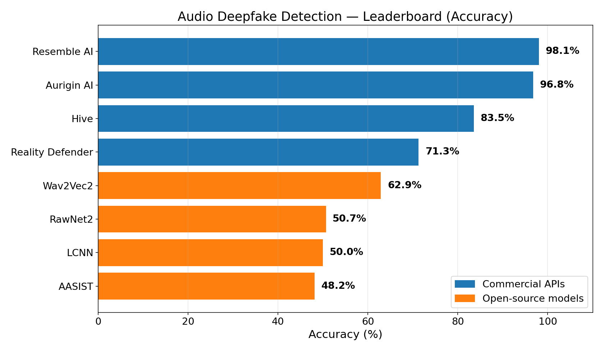
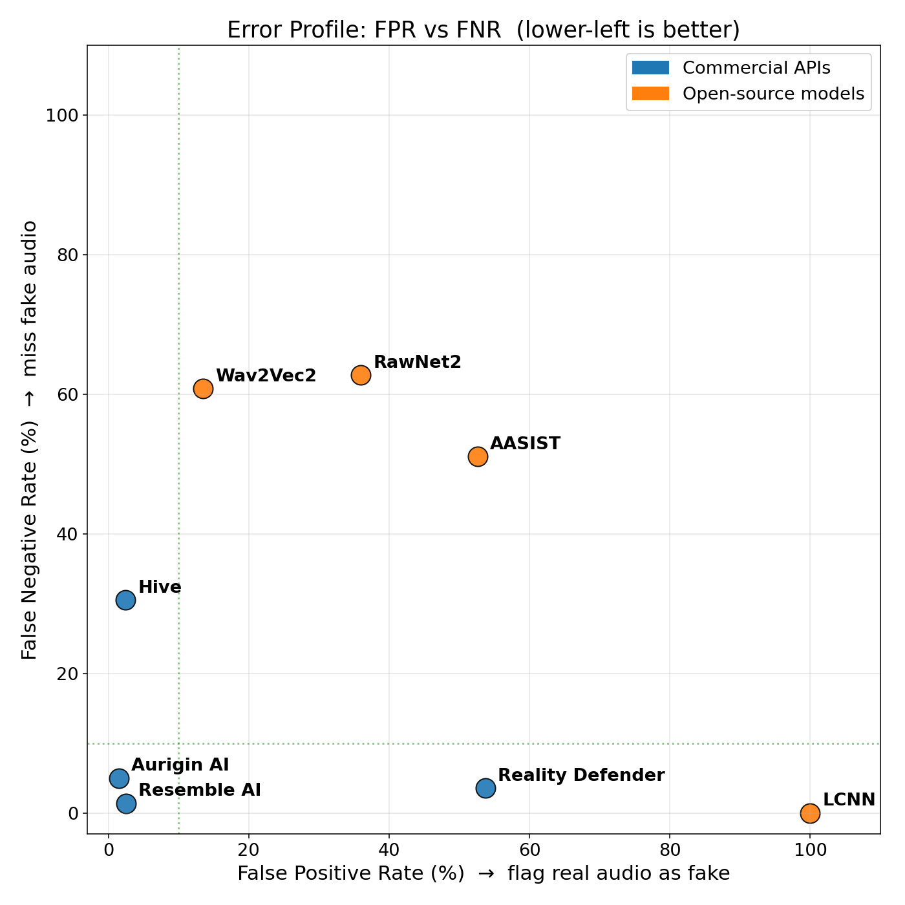
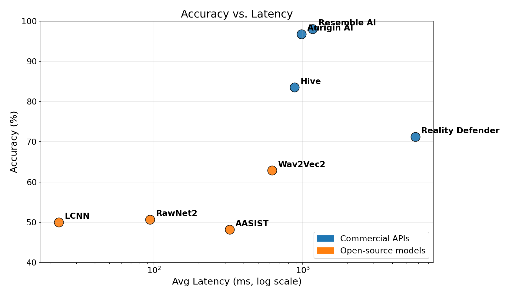

# Deepfake Audio Detection Benchmark



A neutral, public benchmark for evaluating audio deepfake detection systems on a diverse, format-rich dataset.

> **Why this benchmark?** Self-reported deepfake detection scores are often unreliable due to overfitting on public test sets and selective reporting. This project hosts a fixed evaluation set with **private gold-standard labels** held by Podonos, scoring submissions in a verifiable, apples-to-apples manner.

---

## Leaderboard



| # | Model | N | Rej% | Acc% | F1 | FPR% | FNR% | Lat(ms) | RTF |
|---|-------|---|------|------|-----|------|------|---------|-----|
| 1 | **Resemble AI** | 4524 | 0.0% | **98.05%** | **0.981** | 2.5% | 1.4% | 1,164 | 0.40 |
| 2 | **Aurigin AI** | 4524 | 0.0% | **96.75%** | 0.967 | **1.5%** | 5.0% | 980 | 0.33 |
| 3 | Hive AI | 4,524 | 0.0% | 83.53% | 0.808 | 2.4% | 30.5% | 881 | 0.34 |
| 4 | Reality Defender | 3,745 | 17.2% | 71.27% | 0.770 | 53.7% | 3.6% | 5,718 | 1.52 |
| 5 | Wav2Vec2 | 4524 | 0.0% | 62.89% | 0.514 | 13.4% | 60.8% | 622 | 0.14 |
| 6 | RawNet2 | 4524 | 0.0% | 50.66% | 0.430 | 35.9% | 62.7% | 94 | 0.03 |
| 7 | LCNN (LFCC) | 4524 | 0.0% | 50.00% | 0.667 | 100.0% | 0.0% | 23 | 0.006 |
| 8 | AASIST | 4524 | 0.0% | 48.17% | 0.486 | 52.6% | 51.1% | 322 | 0.11 |

**Legend**:
- **N** — number of evaluated audio files
- **Rej%** — % of files the API rejected (NOT_APPLICABLE / errors)
- **Acc%** — overall accuracy
- **FPR%** — false positive rate (real flagged as fake)
- **FNR%** — false negative rate (fake missed)
- **Lat(ms)** — average per-file inference latency
- **RTF** — real-time factor: prediction-time / audio-duration (lower is better)

### Observations

**Top tier — Aurigin and Resemble lead the field:**

Two commercial APIs separate themselves clearly from the rest. Both are production-ready, both over 96 % accuracy, and both deliver F1 above 0.96. The choice between them depends on which error you can least afford in your deployment.

- **Resemble AI** — **98.05 % accuracy**, F1 **0.981**, **FNR 1.4 %**. Best at *catching fakes*: only ~1 in 70 deepfakes slips past it. FPR is 2.5 %. Choose Resemble when **missing a deepfake is worse than a false alarm** — e.g. fraud / KYC voice verification, content provenance, anything where letting a synthetic voice through is the high-cost outcome.
- **Aurigin AI** — **96.75 % accuracy**, F1 **0.967**, **FPR 1.5 %**. Best at *protecting real audio*: only ~1 in 65 genuine clips is wrongly flagged. FNR is 5.0 %. Choose Aurigin when **false alarms on real audio are worse than missed fakes** — e.g. content moderation at scale, automated takedowns, journalist verification, anywhere a wrongful "fake" label is reputationally costly.

In short: **both are excellent**. They sit at opposite corners of the precision/recall trade-off, and the right pick is the one whose error profile matches the cost of mistakes in your application.

**Mid tier — narrow trade-offs:**
- **Hive AI** — 83.5 % accuracy, FPR 2.4 % (very low), FNR 30.5 % (high). Conservative: rarely cries wolf, but misses about a third of fakes.
- **Reality Defender** — 71.3 % accuracy and **FPR 53.7 %** (false-flags over half of real audio). Also **rejects 17.2 % of files** outright — its inference engine cannot evaluate audio shorter than 1.5 s.

**Bottom tier — open-source baselines:**
- All four open-source models score 48–63 %, near random for binary classification. They were trained on **ASVspoof 2019 LA** (older voice-cloning attacks) and do not generalize to modern commercial TTS systems like ElevenLabs or F5-TTS.
- **Wav2Vec2** is the strongest open baseline (62.9 %), reflecting the value of self-supervised audio representations.
- **LCNN** has the fastest RTF (0.006 — ~170× faster than real-time) but classifies *every* file as fake (100 % FPR). Broken on this distribution despite the speed.
- **RawNet2** has the best speed-to-quality balance among open-source: 50.7 % accuracy at RTF 0.03.

**Latency / RTF:**
- Reality Defender's **RTF > 1.0** means it is slower than real-time — a 5-second clip takes ~7.6 seconds to process. Not viable for streaming.
- All other detectors run faster than real-time (RTF < 1). Resemble and Aurigin land around RTF 0.33–0.40, well within real-time budgets.
- LCNN, RawNet2, AASIST run on local hardware (no network round-trip), so their RTF reflects pure compute cost.

### Error Profile



### Accuracy vs Latency Tradeoff



---

## Dataset

- **4,524 audio files** spanning six formats: `.mp3`, `.wav`, `.flac`, `.ogg`, `.m4a`, `.webm`
- **Class balance**: 50/50 (real / fake)
- **Real audio** drawn from three established public corpora:
  - [VCTK](https://datashare.ed.ac.uk/handle/10283/3443) — 110 English speakers, multiple accents
  - [LJSPEECH](https://keithito.com/LJ-Speech-Dataset/) — single-speaker, ~24 hours of public-domain audiobook recordings
  - [LibriTTS-360](https://www.openslr.org/60/) — 360-hour subset of LibriTTS, 904 speakers
- **Synthetic audio**: ~25 commercial TTS / voice-cloning models including [Chatterbox](https://github.com/resemble-ai/chatterbox), [ElevenLabs](https://elevenlabs.io/), [Microsoft F5-TTS](https://github.com/SWivid/F5-TTS), and others
- **Quality verification**: All synthetic audio is round-trip transcribed with [OpenAI Whisper](https://github.com/openai/whisper) to ensure the TTS system synthesized the intended utterance, before format conversion.

See [`DATASET.md`](DATASET.md) for full construction details.

---

## How to Reproduce

### 1. Clone and install

```bash
git clone https://github.com/podonos/audio-dfd-benchmark.git
cd audio-dfd-benchmark
pip install -r requirements.txt

# Install ffmpeg (for audio conversion)
# macOS:  brew install ffmpeg
# Linux:  apt-get install ffmpeg
```

### 2. Convert audio to 16 kHz mono WAV (open-source models only)

```bash
python scripts/convert_audio.py
```

This populates `dataset_wav16k/` with 4,524 normalized WAV files.

### 3. Run open-source models

Each open-source model uses publicly available pre-trained checkpoints.

```bash
python scripts/run_aasist.py     # AASIST  (clovaai/aasist)
python scripts/run_rawnet2.py    # RawNet2 (MattyB95/pre_trained_DF_RawNet2)
python scripts/run_wav2vec2.py   # Wav2Vec2 SSL (Gustking/wav2vec2-large-xlsr-deepfake-audio-classification)
python scripts/run_lcnn.py       # LCNN-LFCC (MattyB95/pre_trained_DF_LFCC-LCNN)
```

Each script writes `results/predictions_<model>.csv` with columns:
`filename`, `label`, `confidence`, `latency_ms`, `audio_duration_sec`.

### 4. Run commercial APIs (optional, requires API keys)

Set the relevant API keys as environment variables:

```bash
export RESEMBLE_API_KEY="<your-key>"
export HIVE_API_KEY="<your-key>"
export REALITY_DEFENDER_API_KEY="<your-key>"
export AURIGIN_API_KEY="<your-key>"

python scripts/run_commercial_apis.py                   # all APIs
python scripts/run_commercial_apis.py --api resemble    # one API
python scripts/run_commercial_apis.py --api hive --limit 100
```

### 5. Compute metrics

```bash
python scripts/compute_metrics.py
```

Outputs the per-model breakdown including per-format accuracy and the leaderboard.

> **Note**: Computing metrics requires the gold-standard labels CSV. The labels are kept private to maintain the benchmark's integrity. Submit your `predictions.csv` to the leaderboard host for scoring.

---

## Models Evaluated

### Commercial APIs

| API | Model | Docs |
|-----|-------|------|
| **Resemble AI** | DETECT-3B Omni | https://docs.resemble.ai/detect |
| **Reality Defender** | RealAPI | https://docs.realitydefender.com |
| **Hive AI** | AI-generated audio detection | https://docs.thehive.ai/docs/ai-generated-audio-detection |
| **Aurigin AI** | Apollo deepfake detection | https://docs.aurigin.ai |

### Open-source baselines

| Model | Source | Architecture |
|-------|--------|--------------|
| **AASIST** | [clovaai/aasist](https://github.com/clovaai/aasist) | Graph attention on raw waveform |
| **RawNet2** | [MattyB95/pre_trained_DF_RawNet2](https://huggingface.co/MattyB95/pre_trained_DF_RawNet2) | End-to-end CNN on raw waveform |
| **Wav2Vec2** | [Gustking/wav2vec2-large-xlsr-deepfake-audio-classification](https://huggingface.co/Gustking/wav2vec2-large-xlsr-deepfake-audio-classification) | SSL + fine-tuned classifier |
| **LCNN-LFCC** | [MattyB95/pre_trained_DF_LFCC-LCNN](https://huggingface.co/MattyB95/pre_trained_DF_LFCC-LCNN) | Lightweight CNN with LFCC frontend |

All open-source baselines are trained on **ASVspoof 2019 LA** and serve as standard academic references. Their lower accuracy on this benchmark reflects the generalization gap between ASVspoof attack methods and modern commercial TTS.

---

## Metrics

For each model we report:

| Metric | Definition |
|--------|------------|
| **Accuracy** | (TP + TN) / Total |
| **F1 score** | 2 · Precision · Recall / (Precision + Recall) |
| **FPR** (False Positive Rate) | FP / (FP + TN) — real flagged as fake |
| **FNR** (False Negative Rate) | FN / (FN + TP) — fake missed |
| **Latency** | Mean round-trip time per file (ms) |
| **Real-time factor (RTF)** | Latency / audio duration |
| **Per-format performance** | Same metrics broken down by `.mp3`, `.wav`, `.flac`, `.ogg`, `.m4a`, `.webm` |
| **Rejection ratio** | (NOT_APPLICABLE + errors) / attempted calls |

We deliberately do **not** report Equal Error Rate (EER), since EER assumes an oracle threshold that cannot be set in production.

---

## Submission Format

Produce a CSV file `predictions.csv` with two columns:

```csv
filename,label
0.flac,real
1.webm,fake
2.mp3,real
...
```

Labels must be exactly `real` or `fake` (lowercase). Submit to the leaderboard host for scoring against the private gold standard.

---

## Related Work

- [Speech-DF-Arena](https://huggingface.co/spaces/Speech-Arena-2025/Speech-DF-Arena)
- [DFBench Speech Leaderboard](https://huggingface.co/spaces/DFBench/Leaderboard-Speech-2025)
- [ASVspoof 2019 / 2021](https://www.asvspoof.org/)
- [Audio Anti-Spoofing Detection Survey](https://arxiv.org/abs/2404.13914)

---

## License

This benchmark code is released under the MIT License (see [`LICENSE`](LICENSE)).

The audio dataset is provided for research and benchmarking purposes only. Source corpora retain their respective licenses (VCTK: ODC-BY; LJSPEECH: public domain; LibriTTS: CC BY 4.0). Synthetic samples are generated under the terms of each TTS vendor's API ToS.

---
