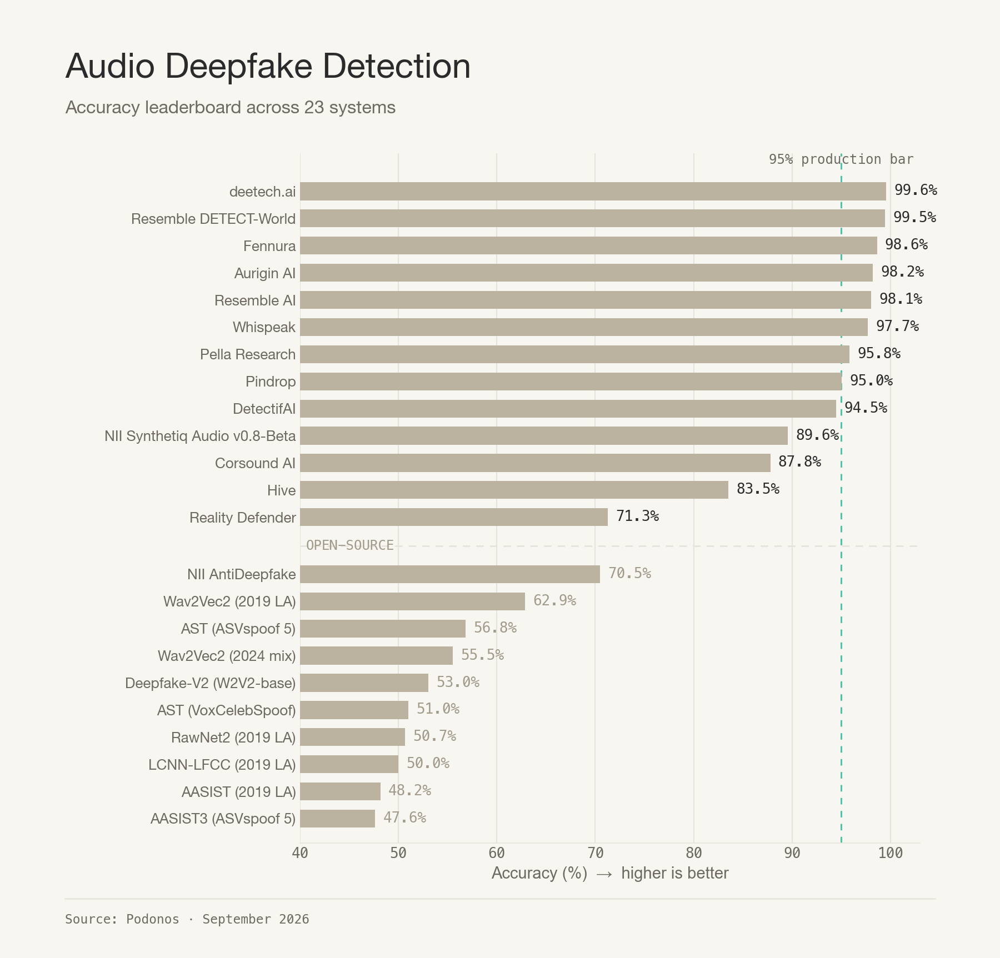
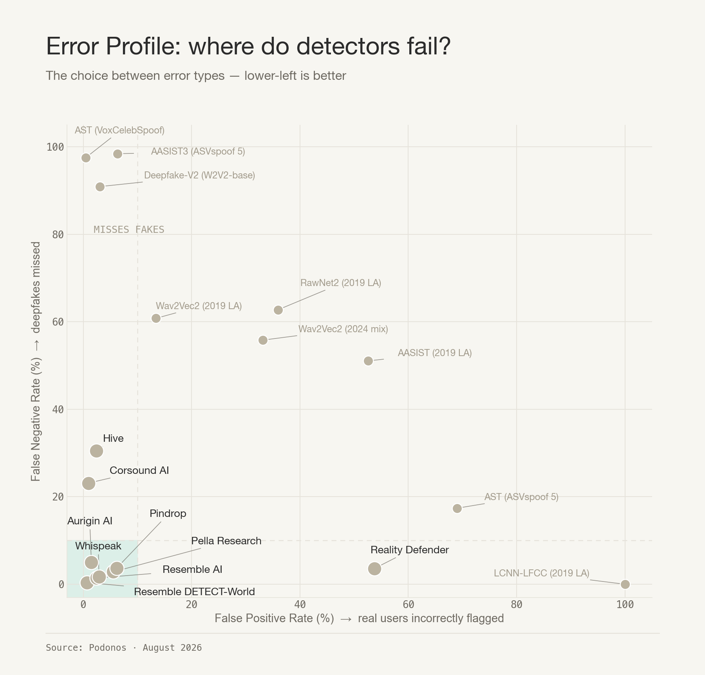
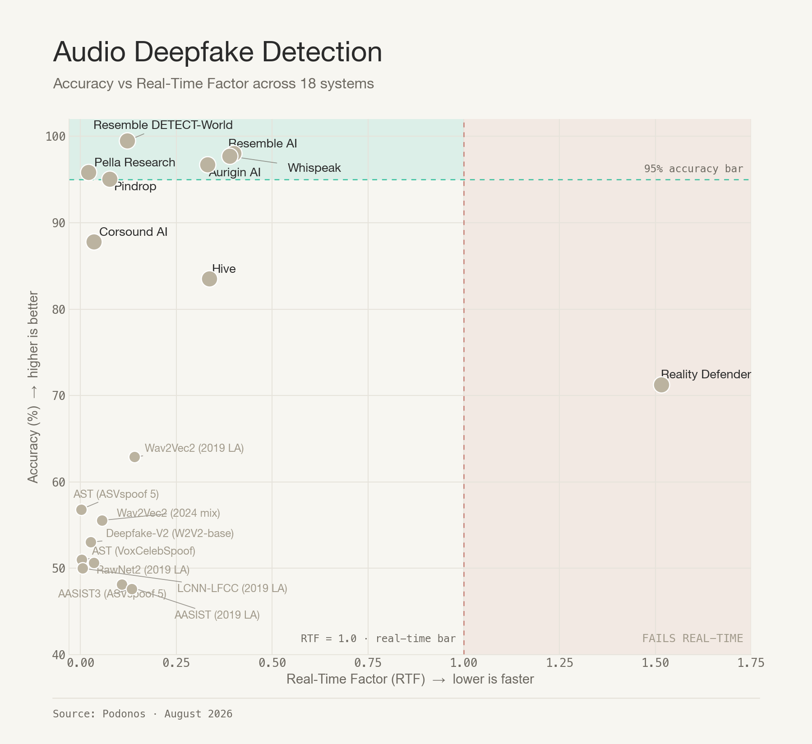

# Deepfake Audio Detection Benchmark



A neutral, public benchmark for evaluating audio deepfake detection systems on a diverse, format-rich dataset.

> **Why this benchmark?** Self-reported deepfake detection scores are often unreliable due to overfitting on public test sets and selective reporting. This project hosts a fixed evaluation set with **private gold-standard labels** held by Podonos, scoring submissions in a verifiable, apples-to-apples manner.

---

## Leaderboard



**23 systems** published: 13 commercial entries (**bold**) from 12 vendors, since Resemble appears twice, and 10 systems whose weights you can download, sorted by accuracy. **Pella Research** is a commercial provider that also open-sourced its model (MIT), so it appears among the commercial entries while its weights stay downloadable. **NII** appears twice for two separate systems: Synthetiq Audio is licensed commercially, AntiDeepfake is an open-weights research release.

| # | System | N | Rej% | Acc% | F1 | FPR% | FNR% | Lat(ms) | RTF |
|---|--------|---|------|------|-----|------|------|---------|-----|
| 1 | **[deetech.ai](https://deetech.ai)** | 4524 | 0.0% | **99.56%** | 0.996 | 0.4% | 0.4% | 50 | n/a |
| 2 | **[Resemble DETECT-World](https://www.resemble.ai)** | 4524 | 0.0% | 99.47% | 0.995 | 0.7% | 0.4% | 399 | 0.12 |
| 3 | **[Fennura](https://fennura.ai)** | 4524 | 0.0% | 98.63% | 0.986 | 1.2% | 1.5% | 553 | 0.14 |
| 4 | **[Aurigin AI](https://aurigin.ai)** | 4524 | 0.0% | 98.21% | 0.982 | 2.4% | 1.1% | n/a | n/a |
| 5 | **[Resemble AI](https://www.resemble.ai)** ‡ | 4524 | 0.0% | 98.05% | 0.981 | 2.5% | 1.4% | 1,164 | 0.40 |
| 6 | **[Whispeak](https://whispeak.io)** | 4524 | 0.0% | 97.70% | 0.977 | 2.9% | 1.7% | 1,052 | 0.39 |
| 7 | **[Pella Research](https://pellaresearch.com)** † | 4524 | 0.0% | 95.82% | 0.959 | 5.5% | 2.8% | 57 | 0.021 |
| 8 | **[Pindrop](https://www.pindrop.com)** | 4524 | 0.0% | 95.05% | 0.951 | 6.2% | 3.7% | 282 | 0.076 |
| 9 | **[DetectifAI](https://detectif.ai)** | 4524 | 0.0% | 94.47% | 0.946 | 8.4% | 2.7% | 24 | 0.0084 |
| 10 | **[NII Synthetiq Audio v0.8-Beta](https://yamagishilab.jp)** | 4524 | 0.0% | 89.57% | 0.892 | 6.6% | 14.2% | 91 | 0.024 |
| 11 | **[Corsound AI](https://www.corsound.ai)** | 3875 | 14.3% | 87.79% | 0.865 | 1.0% | 23.1% | 180 | 0.035 |
| 12 | **[Hive](https://thehive.ai)** ‡ | 4524 | 0.0% | 83.53% | 0.808 | 2.4% | 30.5% | 881 | 0.34 |
| 13 | **[Reality Defender](https://www.realitydefender.com)** ‡ | 3745 | 17.2% | 71.27% | 0.770 | 53.7% | 3.6% | 5,718 | 1.52 |
| 14 | [NII AntiDeepfake](https://huggingface.co/nii-yamagishilab/xls-r-2b-anti-deepfake) † | 4524 | 0.0% | 70.47% | 0.584 | 0.4% | 58.6% | 91 | 0.024 |
| 15 | [Wav2Vec2 (2019 LA)](https://huggingface.co/Gustking/wav2vec2-large-xlsr-deepfake-audio-classification) | 4524 | 0.0% | 62.89% | 0.514 | 13.4% | 60.8% | 622 | 0.14 |
| 16 | [AST (ASVspoof 5)](https://huggingface.co/MattyB95/AST-ASVspoof5-Synthetic-Voice-Detection) | 4524 | 0.0% | 56.83% | 0.657 | 69.0% | 17.4% | 5 | 0.0017 |
| 17 | [Wav2Vec2 (2024 mix)](https://huggingface.co/garystafford/wav2vec2-deepfake-voice-detector) | 4524 | 0.0% | 55.55% | 0.499 | 33.1% | 55.8% | 219 | 0.056 |
| 18 | [Deepfake-V2 (W2V2-base)](https://huggingface.co/MelodyMachine/Deepfake-audio-detection-V2) | 4524 | 0.0% | 53.03% | 0.162 | 3.1% | 90.9% | 94 | 0.027 |
| 19 | [AST (VoxCelebSpoof)](https://huggingface.co/MattyB95/AST-VoxCelebSpoof-Synthetic-Voice-Detection) | 4524 | 0.0% | 50.99% | 0.048 | 0.5% | 97.5% | 8 | 0.0030 |
| 20 | [RawNet2 (2019 LA)](https://huggingface.co/MattyB95/pre_trained_DF_RawNet2) | 4524 | 0.0% | 50.66% | 0.430 | 35.9% | 62.7% | 94 | 0.035 |
| 21 | [LCNN-LFCC (2019 LA)](https://huggingface.co/MattyB95/pre_trained_DF_LFCC-LCNN) | 4524 | 0.0% | 50.00% | 0.667 | 100.0% | 0.0% | 23 | 0.0056 |
| 22 | [AASIST (2019 LA)](https://github.com/clovaai/aasist) | 4524 | 0.0% | 48.17% | 0.486 | 52.6% | 51.1% | 322 | 0.11 |
| 23 | [AASIST3 (ASVspoof 5)](https://huggingface.co/lab260/AASIST3) | 4524 | 0.0% | 47.63% | 0.029 | 6.3% | 98.4% | 363 | 0.13 |

**Legend**:
- **N**: number of evaluated audio files
- **Rej%**: % of files the system rejected (`NOT_APPLICABLE` / `error`). Systems with Rej% > 0 are scored only on the files they accepted, so their rows are not directly comparable to full-coverage rows. Re-scoring full-coverage systems on those same subsets moves them by −1.2 to +4.2 pp (most gain under 2 pp; Hive gains ~4)
- **Acc%**: overall accuracy
- **FPR%**: false positive rate (real flagged as fake)
- **FNR%**: false negative rate (fake missed)
- **Lat(ms)**: average per-file inference latency; measured by Podonos for ‡ systems, self-reported for other commercial systems, and measured locally by Podonos for the open-source baselines
- **RTF**: real-time factor (lower is better). The mean of per-file latency/duration, so short clips dominate; it is *not* Lat(ms) divided by mean duration
- **†**: commercial vendor that also publishes open weights (see [Open-weights leaderboard](#open-weights-leaderboard))
- **‡**: run by Podonos against the vendor's API; its Lat(ms)/RTF were measured by us, not self-reported

> **What is and isn't verified.** Every system is scored the same way: Podonos takes the labels in a `predictions.csv` and scores them against gold-standard labels it holds privately. **Acc%, F1, FPR% and FNR% are therefore independently verified for every system on this board.**
>
> The speed columns are not, and their provenance is mixed. Systems marked ‡ were run by Podonos directly against the vendor's API when the benchmark was first built, so their **Lat(ms)/RTF were measured by us and include network round-trip**. Every other commercial system produced and submitted its own `predictions.csv`, so its **Lat(ms)/RTF are the vendor's own figures, measured on the vendor's own hardware**, and may or may not include network time. Open-source baselines were run locally by Podonos on the same machine. Because the column mixes three measurement regimes, treat **Lat(ms)** and **RTF** as indicative only, and do not read small differences between systems as meaningful.

### Open-weights leaderboard

Ranking everything together buries one result: **of the 11 systems here whose weights you can download and run, Pella Research is far and away the best**, and the only one near production quality.

| # | Open-weights system | Acc% | F1 | License |
|---|---------------------|------|-----|---------|
| 1 | **[Pella Research: pellav2](https://huggingface.co/Sadanie/pellav2-audio-deepfake-detector)** | **95.82%** | 0.959 | MIT |
| 2 | [NII AntiDeepfake](https://huggingface.co/nii-yamagishilab/xls-r-2b-anti-deepfake) | 70.47% | 0.584 | **CC BY-NC-SA-4.0** (non-commercial) |
| 3 | [Wav2Vec2 (2019 LA)](https://huggingface.co/Gustking/wav2vec2-large-xlsr-deepfake-audio-classification) | 62.89% | 0.514 | Apache-2.0 |
| 4 | [AST (ASVspoof 5)](https://huggingface.co/MattyB95/AST-ASVspoof5-Synthetic-Voice-Detection) | 56.83% | 0.657 | BSD-3-Clause |
| 5 | [Wav2Vec2 (2024 mix)](https://huggingface.co/garystafford/wav2vec2-deepfake-voice-detector) | 55.55% | 0.499 | Apache-2.0 |
| 6 | [Deepfake-V2 (W2V2-base)](https://huggingface.co/MelodyMachine/Deepfake-audio-detection-V2) | 53.03% | 0.162 | Apache-2.0 |
| 7 | [AST (VoxCelebSpoof)](https://huggingface.co/MattyB95/AST-VoxCelebSpoof-Synthetic-Voice-Detection) | 50.99% | 0.048 | MIT |
| 8 | [RawNet2 (2019 LA)](https://huggingface.co/MattyB95/pre_trained_DF_RawNet2) | 50.66% | 0.430 | MIT |
| 9 | [LCNN-LFCC (2019 LA)](https://huggingface.co/MattyB95/pre_trained_DF_LFCC-LCNN) | 50.00% | 0.667 | MIT |
| 10 | [AASIST (2019 LA)](https://github.com/clovaai/aasist) | 48.17% | 0.486 | MIT |
| 11 | [AASIST3 (ASVspoof 5)](https://huggingface.co/lab260/AASIST3) | 47.63% | 0.029 | **CC BY-NC-4.0** (non-commercial) |

The 95.82 % figure was produced by the public `pellav2` checkpoint, confirmed by the vendor. **Two are non-commercial: NII AntiDeepfake (CC BY-NC-SA-4.0) and AASIST3 (CC BY-NC-4.0)**; the rest permit commercial use.

**Pella Research leads the next open model by 25.4 percentage points** and is the only downloadable system to clear the 95 % production bar. None of the systems above it publishes downloadable weights. So if you need a model you can inspect or audit yourself, the practical choice set is one deep, and the gap to the next open model is not incremental.

Pella also sells a hosted API; the open weights are in addition, not instead.

### Observations

**Commercial systems.** Eight clear 95 % accuracy. Pick by which error costs you more.

- **deetech.ai**: 99.56 %, F1 0.996, the highest accuracy on the board, with FPR and FNR both at 0.4 % (20 misclassified clips out of 4,524). Its `predictions.csv` assigns exactly 2,262 real and 2,262 fake, matching the published 50/50 class balance; that calibration forces FPR and FNR to be equal, so its error split reflects the chosen operating point rather than an independent property of the detector. It reported per-file latency but no clip durations, so it has no RTF.
- **Resemble DETECT-World**: 99.47 %, F1 0.995. One of two systems with **both** error rates under 1 % (FPR 0.7 %, FNR 0.4 %): it misses ~1 in 250 fakes and false-flags ~1 in 150 real clips. 99.2–99.7 % on every format, no weak spot, and unlike the system above it, its threshold was set without reference to the class balance.
- **Fennura**: 98.63 %, F1 0.986, balanced 1.2 % FPR / 1.5 % FNR. Generated entirely on a notebook CPU with no GPU at inference time, which makes it the strongest result here from an on-device target.
- **Aurigin AI**: 98.21 %, F1 0.982, FNR 1.1 % against FPR 2.4 %. This is an updated model the vendor submitted in September; it did not include latency figures, so it has no Lat/RTF.
- **DetectifAI**: 94.47 %, F1 0.946, and the lowest reported per-file latency on the board (~24 ms). Errors lean strongly to false positives (FPR 8.4 % / FNR 2.7 %).
- **NII Synthetiq Audio v0.8-Beta**: 89.57 %, F1 0.892, FPR 6.6 % / FNR 14.2 %. Licensed commercially to Japanese companies by the Yamagishi Lab at the National Institute of Informatics; latency measured by the lab on an NVIDIA H100.
- **Resemble AI**: 98.05 %, F1 0.981. FNR 1.4 %, FPR 2.5 %. The previous generation; DETECT-World beats it on both error types at a third of the latency.
- **Whispeak**: 97.70 %, F1 0.977. Balanced 2.9 % FPR / 1.7 % FNR, with no strong lean either way.
- **Aurigin AI**: 96.75 %, F1 0.967. **FPR 1.5 %**, behind only DETECT-World among systems that keep FNR under 10 %. Choose it when **false alarms cost more than missed fakes**: moderation at scale, automated takedowns.
- **Pella Research**: 95.82 %, F1 0.959, and the lowest reported latency of any commercial system here (~57 ms/file). Errors lean to false positives (FPR 5.5 % / FNR 2.8 %); weakest on .m4a (93.6 %) against 97.1 % on .wav and .flac. Also **open-sourced under MIT** ([pellav2](https://huggingface.co/Sadanie/pellav2-audio-deepfake-detector)), the only system here you can both call as an API and run yourself. It scores a **4-second center crop** rather than the whole clip, so its latency is flat with duration and its RTF is not comparable to systems that read the full file. The same applies to the AASIST and RawNet2 baselines, whose runners here also crop to ~4 s.
- **Pindrop**: 95.05 %, F1 0.951, ~282 ms/file. Errors lean to false positives (FPR 6.2 % / FNR 3.7 %).
- **Corsound AI**: 87.8 % at a **1.0 % FPR**, the second-lowest of any commercial system, but 23.1 % FNR (misses ~1 in 4 fakes) and it **rejects 14.3 % of files**. Conservative: rarely false-flags, lets fakes through.
- **Hive**: 83.5 %, FPR 2.4 %, FNR 30.5 %. Same conservative shape as Corsound.
- **Reality Defender**: 71.3 % with **FPR 53.7 %**, false-flagging over half of all real audio. **Rejects 17.2 % of files**, mostly clips under ~1.5 s, and is slower than real-time.

**Open-source baselines: none of the nine legacy checkpoints generalize to modern TTS.**
- All nine land in the **47.6–62.9 %** band, near random. This holds regardless of training era: **ASVspoof 2019 LA** and newer **ASVspoof 5 / VoxCelebSpoof** models both collapse on this distribution of current voice-cloning systems.
- **Wav2Vec2 (2019 LA)** is the strongest of the nine at 62.9 %.
- Two open-weights models sit above that band and are the exceptions to the paragraph: **NII AntiDeepfake** at 70.5 % and **pellav2** at 95.8 %. AntiDeepfake is the most conservative system on the whole board, with an FPR of **0.4 %** against an FNR of **58.6 %**: it essentially never false-flags real audio and misses close to 6 fakes in 10. That is a deliberate operating point, not a failure to train, and it is the right shape for a screening pass where a false accusation is the expensive error.
- Several are **degenerate**, collapsing to one class: **AST (VoxCelebSpoof)** (97.5 % FNR), **AASIST3** (98.4 % FNR) and **Deepfake-V2** (90.9 % FNR) call almost everything real. **LCNN-LFCC** emits a single class under our runner's fixed decision threshold, which sits outside the score range the checkpoint actually produces, so its 50.00 % reflects our harness rather than the model. Their accuracy is an artifact of the 50/50 balance, not skill.
- **Open weights are not the problem; stale training data is.** These nine were trained on ASVspoof-era artifacts modern TTS no longer produces. The two open-weights models trained on current synthesis, [pellav2](#open-weights-leaderboard) and [AntiDeepfake](#open-weights-leaderboard), score **95.82 %** and **70.47 %**.

**Latency / RTF** (mixed provenance: see the note above; not measured on common hardware):
- Reality Defender is the only system slower than real-time: ~5.7 s per file, longer than most clips in the set. Not viable for streaming.
- Everything else runs faster than real-time. Among commercial systems, DetectifAI reports the lowest per-file latency (~24 ms), then deetech.ai (~50 ms) and Pella Research (~57 ms, but on a 4-second crop), then NII Synthetiq (91 ms), Corsound (180 ms), Pindrop (282 ms) and DETECT-World (399 ms); Resemble AI, Whispeak and Hive sit around RTF 0.33–0.40. deetech.ai and Aurigin AI submitted no clip durations, so neither has an RTF and both are omitted from the scatter plot above.
- Several open-source models are faster still (AST at ~5 ms): they run locally with no network hop, so their RTF is pure compute cost. At near-random accuracy that speed buys little.

### Error Profile



### Accuracy vs Real-Time Factor



---

## Dataset

- **4,524 audio files** spanning six formats: `.mp3`, `.wav`, `.flac`, `.ogg`, `.m4a`, `.webm`
- **Class balance**: 50/50 (real / fake)
- **Real audio** drawn from three established public corpora:
  - [VCTK](https://datashare.ed.ac.uk/handle/10283/3443): 110 English speakers, multiple accents
  - [LJ Speech](https://keithito.com/LJ-Speech-Dataset/): single-speaker, ~24 hours of public-domain audiobook recordings
  - [LibriTTS-360](https://www.openslr.org/60/): 360-hour subset of LibriTTS, 904 speakers
- **Synthetic audio**: ~25 commercial TTS / voice-cloning models including [Chatterbox](https://github.com/resemble-ai/chatterbox), [ElevenLabs](https://elevenlabs.io/), [F5-TTS](https://github.com/SWivid/F5-TTS), and others
- **Quality verification**: All synthetic audio is round-trip transcribed with [OpenAI Whisper](https://github.com/openai/whisper) to ensure the TTS system synthesized the intended utterance, before format conversion.

See [`DATASET.md`](DATASET.md) for full construction details.

---

## Telephony Tracks (New)

Most real-world fraud, KYC, and call-center audio never arrives as a studio file. It comes over a phone or mobile/VoIP link: band-limited, resampled, and compressed by a low-bitrate speech codec. We provide **two telephony tracks** that stress detectors under those conditions. Each is the **same 4,524 clips and the same hidden labels** as the main benchmark, only degraded to channel grade, so scores are directly comparable to the studio leaderboard above:

- **Narrowband, 8 kHz** (2G/3G): [`dataset_8k_nb/`](dataset_8k_nb/)
- **Wideband, 16 kHz** (4G/5G): [`dataset_16k_wb/`](dataset_16k_wb/)

In each track, every clip is decoded, resampled to the track rate with a high-quality anti-aliased resampler, band-pass filtered to the channel passband, passed through **one randomly assigned codec** (full encode then decode, so it picks up that codec's real compression artifacts), and written as 16-bit mono WAV. The per-file codec assignment is seeded, stratified across source formats, and kept **private** (like the labels). The two tracks use **independent permutations**, so their file orders do not line up with each other or with the studio set. Both tracks are released as audio only; the codec pipeline is kept private to preserve benchmark integrity.

PESQ is measured against the clean track-rate reference (higher is better); Whisper-WER is the word-error rate of the codec'd clip versus the clean-reference transcript (lower means intelligibility is preserved).

### Narrowband track: 8 kHz (2G/3G)

Codec pool: landline (G.711 μ-law / A-law), 2G/3G mobile (GSM-FR, AMR-NB), and VoIP (G.729). Band-pass 300 to 3400 Hz. 4,524 clips, ~6 hours, mean 4.80 s.

| Codec | Bitrate | Files | PESQ-NB (mean) ↑ | Whisper-WER (mean) ↓ |
|-------|--------:|------:|-----------------:|---------------------:|
| G.711 μ-law | 64 kbit/s | 905 | 4.44 | 5.3% |
| G.711 A-law | 64 kbit/s | 903 | 4.44 | 4.4% |
| AMR-NB | 12.2 kbit/s | 904 | 4.07 | 8.4% |
| G.729 | 8 kbit/s | 906 | 3.71 | 6.4% |
| GSM-FR | 13 kbit/s | 906 | 3.51 | 11.0% |

### Wideband track: 16 kHz (4G/5G)

Codec pool: the 4G/5G mobile wideband codecs EVS-WB and AMR-WB (G.722.2), each at two bitrates. Band-pass 50 to 7000 Hz. 4,524 clips, ~6 hours, mean 4.80 s.

| Codec | Bitrate | Files | PESQ-WB (mean) ↑ | Whisper-WER (mean) ↓ |
|-------|--------:|------:|-----------------:|---------------------:|
| EVS-WB | 24.4 kbit/s | 1129 | 4.05 | 2.0% |
| AMR-WB | 23.85 kbit/s | 1133 | 3.72 | 3.2% |
| EVS-WB | 13.2 kbit/s | 1130 | 3.69 | 4.0% |
| AMR-WB | 12.65 kbit/s | 1132 | 3.27 | 4.0% |

In both tracks the PESQ ordering is the expected one (higher bitrate and newer codecs score higher, and EVS edges AMR-WB at matched rates). Median word-error rates stay low across the codec pool, so the clips remain intelligible after degradation and the detection task stays fair.

### Submit your results

Run your detector over a track's folder (filenames are `0.wav`, `1.wav`, ...) and submit a `predictions.csv` as described in [Submission Format](#submission-format) below. Each track is scored against its own private gold standard. The telephony leaderboards open as submissions arrive; the studio leaderboard above is already live.

---

## How to Reproduce

### 1. Clone and install

```bash
git clone https://github.com/podonos/audio-dfd-benchmark.git
cd audio-dfd-benchmark
pip install -r requirements.txt

# Install ffmpeg (for audio conversion)
# macOS:  brew install ffmpeg
# Linux:  apt-get install ffmpeg
```

### 2. Convert audio to 16 kHz mono WAV (open-source models only)

```bash
python scripts/convert_audio.py
```

This populates `dataset_wav16k/` with 4,524 normalized WAV files.

### 3. Run open-source models

Each open-source model uses publicly available pre-trained checkpoints. Runners for four of the nine are included below; the remaining five were run with equivalent HuggingFace pipelines.

```bash
python scripts/run_aasist.py     # AASIST  (clovaai/aasist)
python scripts/run_rawnet2.py    # RawNet2 (MattyB95/pre_trained_DF_RawNet2)
python scripts/run_wav2vec2.py   # Wav2Vec2 SSL (Gustking/wav2vec2-large-xlsr-deepfake-audio-classification)
python scripts/run_lcnn.py       # LCNN-LFCC (MattyB95/pre_trained_DF_LFCC-LCNN)
```

Each script writes `results/predictions_<model>.csv` with at least `filename`, `label` and `latency_ms`; confidence column names vary by model. The scorer reads only `filename`, `label`, `latency_ms` and `audio_duration_sec`, and these runners do not emit `audio_duration_sec`, so RTF is reported as N/A unless you add it.

### 4. Commercial systems

This repository does not call vendor APIs, and there is no script here that will.

The four systems marked ‡ on the leaderboard were run by Podonos against the vendors' APIs when
the benchmark was first built. That code has since been retired: every commercial result added
since then comes from a `predictions.csv` the vendor produced and submitted themselves, and that
is now the only route onto the board. To have a system scored, run it over the dataset on your own
infrastructure and send us the file in the format described under
[Submission Format](#submission-format).

### 5. Compute metrics

```bash
python scripts/compute_metrics.py
```

Outputs the per-model breakdown including per-format accuracy and the leaderboard.

> **Note**: Computing metrics requires the gold-standard labels CSV. The labels are kept private to maintain the benchmark's integrity. Email your `predictions.csv` to **hello@podonos.com** for scoring.

---

## Models Evaluated

### Commercial APIs

These 13 entries come from 12 vendors, since Resemble appears twice. All offer a hosted detection API or a commercial licence; **Pella Research** additionally publishes its weights under MIT, and the **NII** Yamagishi Lab separately publishes the open-weights AntiDeepfake model listed among the open-source baselines below.

| Vendor | Product / Model | Docs / Product page |
|--------|-----------------|---------------------|
| [**Resemble AI**](https://www.resemble.ai) | DETECT-World (leaderboard row 1) | https://docs.resemble.ai/detect |
| [**Resemble AI**](https://www.resemble.ai) | DETECT-3B Omni (leaderboard row 2, listed as "Resemble AI") | https://docs.resemble.ai/detect |
| [**Whispeak**](https://whispeak.io) | Voice Biometric Authentication (anti-spoofing) | https://whispeak.io/voice-authentication/ |
| [**Aurigin AI**](https://aurigin.ai) | Apollo deepfake detection | https://docs.aurigin.ai |
| [**Pella Research**](https://pellaresearch.com) | pellav2 (hosted API + open weights, MIT) | https://pellaresearch.com · [weights](https://huggingface.co/Sadanie/pellav2-audio-deepfake-detector) |
| [**Pindrop**](https://www.pindrop.com) | Pindrop Pulse | https://www.pindrop.com/product/pindrop-pulse/ |
| [**Corsound AI**](https://www.corsound.ai) | Deepfake Detect | https://apis.corsound.ai/ |
| [**Hive**](https://thehive.ai) | AI-generated audio detection | https://docs.thehive.ai/docs/ai-generated-audio-detection |
| [**Reality Defender**](https://www.realitydefender.com) | RealAPI | https://docs.realitydefender.com |
| [**deetech.ai**](https://deetech.ai) | deetech.ai v2 | https://deetech.ai |
| [**Fennura**](https://fennura.ai) | On-device detector (CPU-only inference) | https://fennura.ai |
| [**DetectifAI**](https://detectif.ai) | Real-time audio deepfake detection | https://detectif.ai |
| [**NII Yamagishi Lab**](https://yamagishilab.jp) | Synthetiq Audio v0.8-Beta (commercial licence) | https://yamagishilab.jp |

### Open-source baselines

Two generations of baseline are included: **legacy** models trained on ASVspoof 2019 LA, and **modern** models trained on the newer ASVspoof 5 / VoxCelebSpoof corpora. Neither generation generalizes to the modern commercial TTS in this benchmark. **NII AntiDeepfake** is listed here as an open-weights release rather than a baseline: it was submitted by its authors and scores well above both generations.

| Model | Source | Architecture | Training data |
|-------|--------|--------------|---------------|
| [NII AntiDeepfake](https://huggingface.co/nii-yamagishilab/xls-r-2b-anti-deepfake) | nii-yamagishilab/xls-r-2b-anti-deepfake ([paper](https://arxiv.org/abs/2506.21090), ASRU 2025) | XLS-R 2B | see paper |
| [Wav2Vec2 (2019 LA)](https://huggingface.co/Gustking/wav2vec2-large-xlsr-deepfake-audio-classification) | Gustking/wav2vec2-large-xlsr-deepfake-audio-classification | SSL XLSR + fine-tuned classifier | ASVspoof 2019 LA |
| [AASIST (2019 LA)](https://github.com/clovaai/aasist) | clovaai/aasist | Graph attention on raw waveform | ASVspoof 2019 LA |
| [RawNet2 (2019 LA)](https://huggingface.co/MattyB95/pre_trained_DF_RawNet2) | MattyB95/pre_trained_DF_RawNet2 | End-to-end CNN on raw waveform | ASVspoof 2019 LA |
| [LCNN-LFCC (2019 LA)](https://huggingface.co/MattyB95/pre_trained_DF_LFCC-LCNN) | MattyB95/pre_trained_DF_LFCC-LCNN | Lightweight CNN, LFCC frontend | ASVspoof 2019 DF |
| [AASIST3 (ASVspoof 5)](https://huggingface.co/lab260/AASIST3) | lab260/AASIST3 | Graph attention on raw waveform | ASVspoof 5 |
| [AST (ASVspoof 5)](https://huggingface.co/MattyB95/AST-ASVspoof5-Synthetic-Voice-Detection) | MattyB95/AST-ASVspoof5-Synthetic-Voice-Detection | Audio Spectrogram Transformer | ASVspoof 5 |
| [AST (VoxCelebSpoof)](https://huggingface.co/MattyB95/AST-VoxCelebSpoof-Synthetic-Voice-Detection) | MattyB95/AST-VoxCelebSpoof-Synthetic-Voice-Detection | Audio Spectrogram Transformer | VoxCelebSpoof |
| [Wav2Vec2 (2024 mix)](https://huggingface.co/garystafford/wav2vec2-deepfake-voice-detector) | garystafford/wav2vec2-deepfake-voice-detector | Wav2Vec2 + fine-tuned classifier | 2024 real/fake mix |
| [Deepfake-V2 (W2V2-base)](https://huggingface.co/MelodyMachine/Deepfake-audio-detection-V2) | MelodyMachine/Deepfake-audio-detection-V2 | Wav2Vec2-base audio classifier | mixed real/fake |

These checkpoints are standard academic references. Their near-random accuracy on this benchmark reflects the generalization gap between their training attacks (ASVspoof / VoxCelebSpoof) and the modern commercial voice-cloning systems represented here.

---

## Metrics

For each model we report:

| Metric | Definition |
|--------|------------|
| **Accuracy** | (TP + TN) / Total |
| **F1 score** | 2 · Precision · Recall / (Precision + Recall) |
| **FPR** (False Positive Rate) | FP / (FP + TN); real flagged as fake |
| **FNR** (False Negative Rate) | FN / (FN + TP); fake missed |
| **Latency** | Mean per-file inference time (ms); see the leaderboard note on provenance |
| **Real-time factor (RTF)** | Mean of per-file (latency / audio duration); not a per-clip predictor |
| **Per-format performance** | Same metrics broken down by `.mp3`, `.wav`, `.flac`, `.ogg`, `.m4a`, `.webm` |
| **Rejection ratio** | (NOT_APPLICABLE + errors) / attempted calls |

We deliberately do **not** report Equal Error Rate (EER), since EER assumes an oracle threshold that cannot be set in production.

---

## Submission Format

Produce a CSV file `predictions.csv` with `filename`, `label`, `latency_ms` (per-file inference time in milliseconds) and `audio_duration_sec`:

```csv
filename,label,latency_ms,audio_duration_sec
0.flac,real,247.09,1.5325
1.webm,fake,493.58,8.2336
2.mp3,real,289.01,3.4410
...
```

Labels must be exactly `real` or `fake` (lowercase). If your system declines a file, write `NOT_APPLICABLE`; if it errors, write `error`. Both are excluded from scoring and counted in **Rej%**. `latency_ms` gives the **Lat(ms)** column and `audio_duration_sec` is required for **RTF**; leave either blank if you cannot measure it, and that column is reported as N/A.

Submit one CSV per dataset:
- **Studio track:** run over `dataset/`; filenames keep their original extension (e.g. `0.flac`).
- **Narrowband telephony track (8 kHz):** run over `dataset_8k_nb/`; filenames are `0.wav`, `1.wav`, ...
- **Wideband telephony track (16 kHz):** run over `dataset_16k_wb/`; filenames are `0.wav`, `1.wav`, ...

The two telephony tracks use `0.wav`-style filenames; the studio track keeps each file's original extension. All three are **independently shuffled**, so a prediction file for one track will not score on another.

Email your `predictions.csv` to **hello@podonos.com** for scoring against the private gold standard.

---

## Related Work

- [Speech-DF-Arena](https://huggingface.co/spaces/Speech-Arena-2025/Speech-DF-Arena)
- [DFBench Speech Leaderboard](https://huggingface.co/spaces/DFBench/Leaderboard-Speech-2025)
- [ASVspoof 2019 / 2021](https://www.asvspoof.org/)
- [Audio Anti-Spoofing Detection Survey](https://arxiv.org/abs/2404.13914)

---

## License

This benchmark code is released under the MIT License (see [`LICENSE`](LICENSE)).

The audio dataset is provided for research and benchmarking purposes only. Source corpora retain their respective licenses (VCTK: ODC-BY; LJ Speech: public domain; LibriTTS: CC BY 4.0). Synthetic samples are generated under the terms of each TTS vendor's API ToS.
